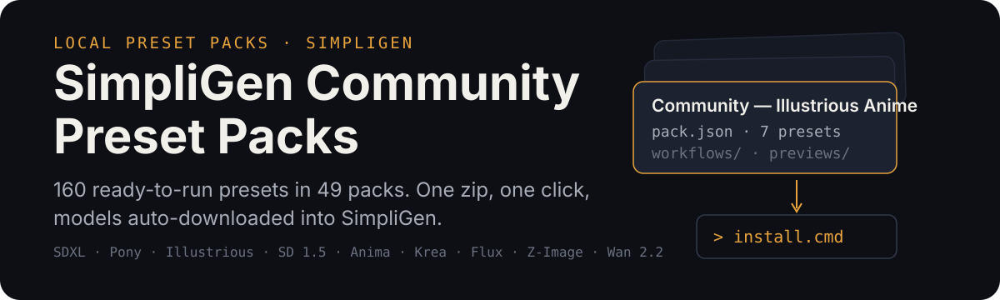
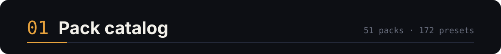
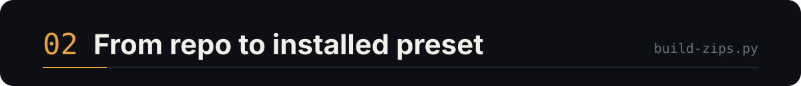
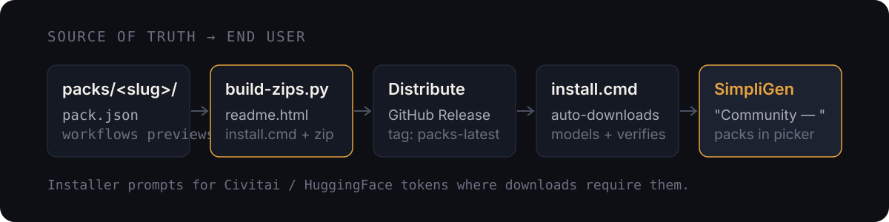
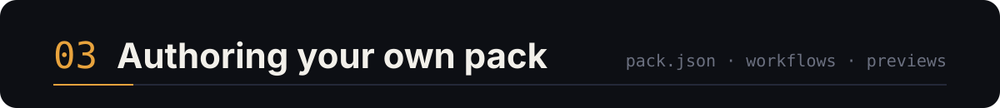

<p align="center">
  
</p>

Custom local preset packs for [SimpliGen](https://www.simpligen.io/), covering image models across SDXL, Pony, Illustrious, SD 1.5, Anima, Krea 2, Flux (1 & 2), Z-Image and SeFi — plus video: four MiniMax H3 packs (text/image/reference-to-video with synchronized audio) and a Wan 2.2 image-to-video pack.

**Getting a pack takes three steps:** download the pack zip from the [Releases page](https://github.com/michaeldune/simpligen-presets/releases/tag/packs-latest) (also linked on the [SimpliGen Discord](./DISCORD-ANNOUNCEMENT.md)), unzip it, and run `install.cmd`. The installer downloads the models for you, verifies them, and the pack appears in SimpliGen's preset picker under `Community — `.

> This repo is the source of truth the zips are built from — and now the distribution point too. The `packs-latest` release is rolling: its assets get replaced each time `build-zips.py` runs, so the same link always has the current set. End users never need to clone it.

<p align="center">
  
</p>

**Image packs**

| Pack | Presets | Architecture | Notes |
|---|---|---|---|
| SDXL Realism | 5 | SDXL 1.0 | Photoreal, baked VAE, no CLIP skip |
| SDXL Art & Anime | 5 | SDXL 1.0 | Stylized/anime |
| Pony Anime | 4 | Pony (SDXL) | CLIP Skip 2, score tags |
| Pony Realistic | 3 | Pony (SDXL) | Photoreal/semi-real |
| Illustrious Realism | 6 | Illustrious (SDXL) | Photoreal & semi-real |
| Illustrious Anime | 8 | Illustrious (SDXL) | Anime, incl. V-Pred models |
| SD 1.5 Anime | 3 | SD 1.5 | External kl-f8-anime2 VAE, 512-base |
| Reij's Merges | 6 | Illustrious (SDXL) | reijlita merge family |
| Anima Anime | 4 | Anima (Cosmos) | UNet + Qwen encoder + Qwen-Image VAE |
| Anima Realism | 2 | Anima (Cosmos) | Same stack, photoreal |
| Krea 2 | 6 | Krea 2 DiT | Uncensored mixes, 8–10 step distilled |
| Krea Flux | 1 | Flux.1 Krea (GGUF) | CSG Foundation, low-VRAM |
| Flux 2 Klein | 3 | Flux 2 | 9B + 4B, 4-step distilled — **non-commercial license (BFL)** |
| Ideogram 4 | 2 | Ideogram 4 (INT8) | Best-in-class text rendering; UltraReal photo + Graphic/Poster tiers — **requires engine 0.28+** |
| SeFi-Image | 2 | SeFi 5B (Q8) | Turbo, 4- and 8-step tiers |
| Moody Models | 5 | Z-Image / Flux | NSFW-biased/uncensored |
| Z-Image | 1 | Z-Image | Semi-real/anime |

**Video packs**

All four MiniMax H3 packs generate video *with synchronized stereo audio*, and each ships text-to-video, image-to-video, and reference-to-video presets off the same base weights — so adding one costs only its LoRA, not another 40 GB.

| Pack | Presets | Architecture | Notes |
|---|---|---|---|
| MiniMax H3 (Turbo LoRA) | 3 | MiniMax H3 (pruned INT8) | The default: 6–8 steps, best for static/small motion |
| MiniMax H3 (Turbo, Fast Motion) | 3 | MiniMax H3 (pruned INT8) | 4-step tier tuned for heavy/fast motion |
| MiniMax H3 (Sol-Attn + EasyCache) | 3 | MiniMax H3 (pruned INT8) | Sparse attention + step caching at the full 20 steps |
| MiniMax H3 (Turbo, Fully Accelerated) | 3 | MiniMax H3 (pruned INT8) | Every technique stacked — Turbo + SageAttention + Sigma Shift + Spectrum + Sol-Attn. 10 steps for roughly what 6 used to cost |
| Wan 2.2 I2V (GGUF) | 1 | Wan 2.2 14B | Image-to-video, Q4 GGUF, 12 GB-friendly |

Measured on a 12 GB RTX 4070 Ti — T2V, 5 s at 480p (864×480), one prompt and one seed across all five, each preset at its own default step count. Engine v0.31.0, SimpliGen 1.46.0:

| Preset | Steps | Time | vs. official |
|---|---|---|---|
| Official MiniMax H3 | 20 | 170.7 s | — |
| Sol-Attn + EasyCache | 20 | 129.5 s | 1.32× |
| Turbo | 6 | 103.8 s | 1.64× |
| **Fully Accelerated** | **10** | **84.1 s** | **2.03×** |
| Turbo, Fast Motion | 4 | 79.5 s | 2.15× |

Engine v0.31.0 took 8–18% off every one of these versus v0.30.1, and not evenly: the two 20-step presets gained most and the low-step Turbo presets least, which is what you would expect if the work landed in per-step execution rather than fixed overhead. Treat these as one run each — a repeat of the Sol-Attn row landed within 2%, but reference-to-video conditioning has shown far wider spread, so the I2V and R2V figures quoted in individual packs are less firm than these.

Every pack is self-contained: a `readme.html` with model download links and destination folders, a one-click `install.cmd` (full pack or single preset), the pack JSON, ComfyUI workflows, and preview thumbnails.

<p align="center">
  
</p>

<p align="center">
  
</p>

```
python build-zips.py
```

Generates `community-<slug>.zip` per pack into `D:\SimpliGen-Backups\zips\` (readme.html + install.cmd/ps1 + pack JSON + workflows + previews). Both image and video packs are built. Any preset relying on a custom ComfyUI node gets that node's repo and install caveat written into its `readme.html` automatically, from the `CUSTOM_NODES` registry at the top of the script — add an entry there when you introduce a new one.

The installer prompts for a **Civitai API token** (required by Civitai for downloads) and a **HuggingFace token** where needed, verifies downloads, and reports failures honestly.

<p align="center">
  
</p>

Each pack lives under `packs/<slug>/`:

```
packs/<slug>/
├── <slug>-pack.json     ← pack manifest (relative previews/ paths)
├── workflows/*.json     ← ComfyUI API-format workflows with {{placeholders}}
└── previews/*.jpg       ← 640×640 thumbnails
```

See [`CUSTOM-PRESET-AUTHORING-GUIDE.md`](./CUSTOM-PRESET-AUTHORING-GUIDE.md) — architecture detection, workflow families, the `simpligen_lora_1` LoRA marker, pack schema, thumbnails, installer conventions, and validation.

Key conventions:
- Models install to `%APPDATA%\simpligen\engine\models\<subfolder>\` — checkpoints→`checkpoints\`, UNet/GGUF→`diffusion_models\`, **CLIP/text encoders→`clip\`**, VAE→`vae\`.
- Pack names carry the `Community — ` prefix so they group together in SimpliGen's picker.
- JSON is UTF-8 **without BOM**; installed `previewImage` uses absolute `local-file:///` URIs, source uses relative paths.

<p align="center">
  <a href="https://github.com/oil-oil/beautify-github-readme"></a>
</p>
