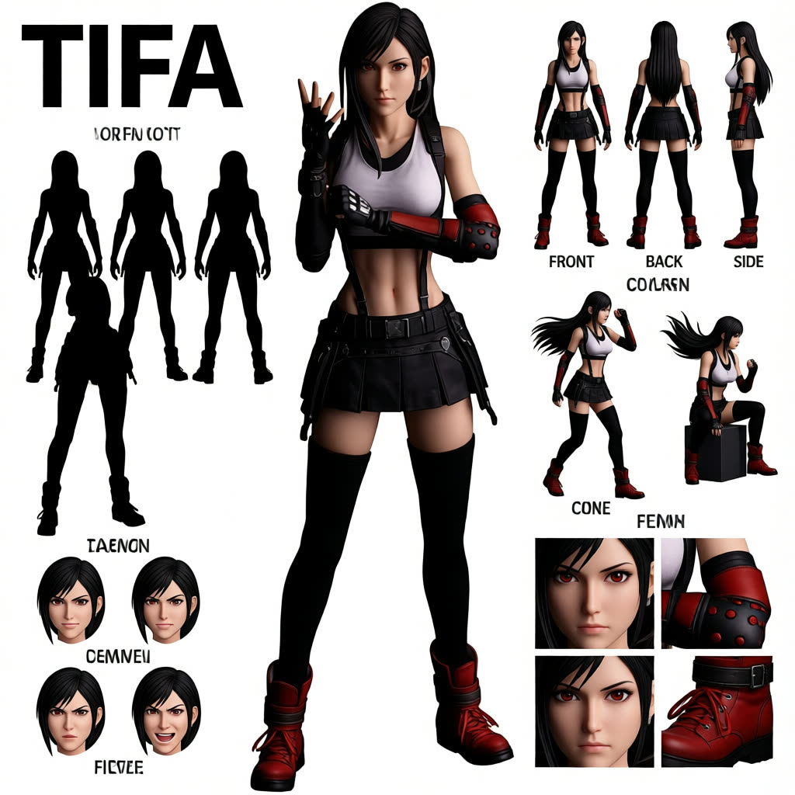
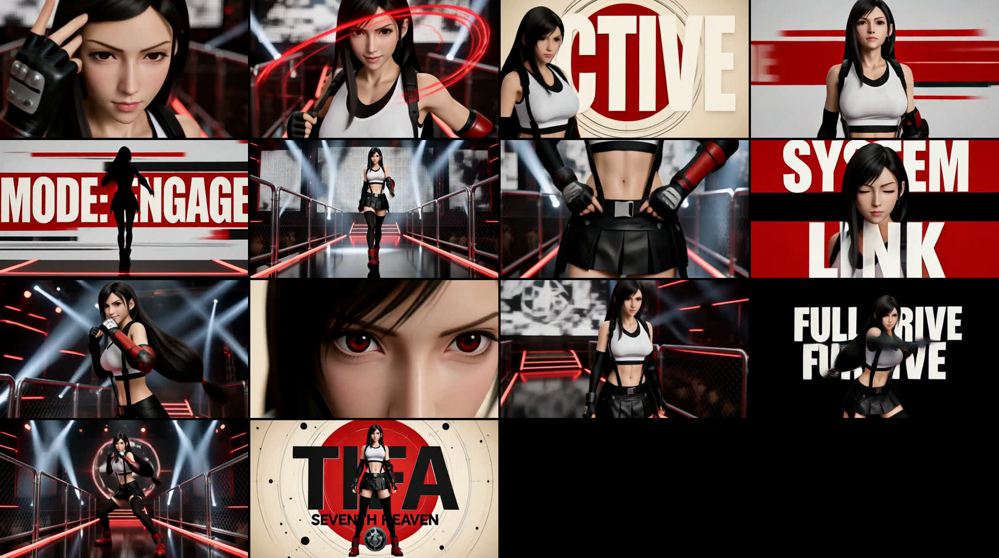

# Character PV: from one picture to a 15-second reveal trailer

A character PV (promotional video) is a short trailer that introduces a
character: fast cuts, a few bold typography cards, a hero pose, and a final
card with the name and a title. This guide is how we make one with MiniMax H3
in two steps, with the exact prompts used. The method comes from Smart Bobo
(机智波玩ai); the templates here are our reconstruction from his outputs, and
they have been verified on a 12 GB RTX 4070 Ti through both vanilla ComfyUI
and the SimpliGen app.

**Contents:** [Source picture](#step-1-the-source-picture) · [Design sheet](#step-2-the-design-sheet) · [PV brief](#step-3-the-pv-brief) · [Rendering](#step-4-rendering) · [What to expect](#what-to-expect-and-what-to-fix) · [Worked examples](examples/)



*The design sheet made from a phone photo of a Tifa figure (Qwen Image Edit, 37 s).*



*The 15-second PV rendered from that sheet, one frame per shot. Five typography cards, the arena wides, and the name and title card.*

The pipeline is:

1. **One source picture** of the character. Anything works: a phone photo, a
   figurine on a desk, a game render, an existing turnaround sheet.
2. **A character design sheet** made from that picture with an
   identity-preserving image editor (Qwen Image Edit locally; GPT Image or
   Nano Banana in the app). This is a 16:9 board with the name as a title,
   a big centre figure, FRONT/BACK/SIDE views, pose studies, expression heads
   and detail crops.
3. **A 13-shot H3 reference-to-video brief** that uses the sheet as its only
   reference. H3 renders the 15-second video with native music and sound.

The sheet does two jobs. It locks identity and wardrobe for every shot, and
it sets the art style the video inherits. A photoreal sheet gives a photoreal
video; an anime sheet gives an anime video; a collectible-figure sheet gives a
figure-style video. Decide the medium at step 2, not step 3.

---

## Step 1: the source picture

Pick one image where the face and the whole outfit are visible. Background
clutter does not matter; the editor drops it. If the character holds a
signature prop (a staff, a weapon) that you want in the video, it must be
visible here, because the sheet will carry it and the brief will name it.

## Step 2: the design sheet

### What the sheet must contain

The layout is fixed and the same for every character, which is what makes it
a reliable reference:

| Region | Content |
|---|---|
| Top left | The character's name as the title, bold sans-serif |
| Left column | Three solid black full-body silhouettes in different stances, then four small expression heads |
| Centre | One very large complete full-body standing figure, head to feet, never cropped, about 85% of frame height |
| Upper right | Three small full-body views in a row labelled FRONT, BACK, SIDE |
| Middle right | Four small pose studies that do not repeat each other |
| Bottom right | Four detail crops: one eye, one signature accessory, one fabric or pattern swatch, one footwear or hardware close-up |

Clean warm-white background, generous white space, small grey labels only, no
arrows, numbering, texture or noise.

### The sheet prompt (short form, for Qwen Image Edit and similar)

Fill in the braces. Keep everything else. This is the form that produced
every sheet in this guide.

```
Turn this into a 16:9 landscape professional character design sheet on a clean
warm-white studio background. Title "{NAME}" in bold black sans-serif at the top
left. {MEDIUM LOCK: e.g. "Photoreal, same woman" / "Keep the medium of the
source: a premium collectible figure with smooth painted PVC skin, sculpted hair
with painted highlights, matte fabric clothing, glossy leather" / "high-end game
cinematic CG render with smooth skin, sculpted hair, fine fur, glossy leather" /
"polished hand-painted thick-paint anime illustration"}. Same face, {HAIR: colour,
length, shape}, {EYES: colour}, same outfit in every panel: {WARDROBE, top to
bottom, naming every graphic, badge, buckle, strap, chain and hardware item}.
{PROP, if any: "She carries a ..."} Centre: one large complete full-body standing
figure, head to {footwear}, about 85 percent of the frame height, {STANCE}. Left
column under the title: three solid black full-body silhouettes in different
stances, then four small expression heads ({FOUR EXPRESSIONS}). Upper right:
three small full-body views in a row labelled FRONT, BACK, SIDE. Middle right:
four small pose studies ({FOUR DISTINCT POSES, e.g. seated on a low block,
crouching, walking turn with hair in motion, leaning on a wall}). Bottom right:
four detail crops ({EYE}, {SIGNATURE ACCESSORY}, {FABRIC OR PATTERN}, {FOOTWEAR}).
Generous white space, small grey labels only, no arrows, no numbering, no
texture, no noise.
```

Worked example, the one that made the Tifa sheet:

```
Turn this into a 16:9 landscape professional character design sheet on a clean
warm-white studio background. Title "TIFA" in bold black sans-serif at the top
left. Keep the medium of the source: a premium collectible figure with smooth
painted PVC skin, sculpted black hair with painted highlights, matte fabric
clothing, glossy leather gloves and boots, crisp product-photo lighting. Same
face with dark red-brown eyes, same very long straight black hair to the hips
with a centre parting, same outfit in every panel: white cropped tank top over a
black sports bra, black leather pleated mini skirt with black suspenders and a
silver-buckled belt, black shorts underneath, long fingerless black gloves with
red studded elbow guards, black over-the-knee stockings, chunky red lace-up combat
boots. Centre: one large complete full-body standing figure, head to boots, about
85 percent of the frame height, relaxed fighting stance with one fist loosely
raised. Left column under the title: three solid black full-body silhouettes in
different stances, then four small expression heads (calm, smile, focused,
fierce). Upper right: three small full-body views in a row labelled FRONT, BACK,
SIDE. Middle right: four small pose studies (boxing guard, low crouch, walking
turn with hair swinging, seated on a low block). Bottom right: four detail crops
(eye, studded glove and red elbow guard, belt buckle with suspender clip, red
boot). Generous white space, small grey labels only, no arrows, no numbering, no
texture, no noise.
```

### The sheet prompt (long form, for an LLM to expand)

If you would rather have an LLM write a very detailed image prompt from the
picture, as Bobo does with GPT, give it the picture and this instruction. It
returns paragraphs you paste into the image model. The long form adds
per-material shading rules, percentage sizes for the centre figure, per-view
checklists for the turnaround, and the multi-character rule.

```
You are writing a single image-generation prompt for a professional character
design sheet based on the attached image. Output only the prompt, in flowing
paragraphs, no headings, no lists, no commentary. Write in English.

The prompt must follow this structure, in this order:

1. FORMAT AND MEDIUM. Open with: a 16:9 landscape, highly finished professional
   character visual design board. State the character's name and that the page's
   main title must render exactly as that name, letter for letter. Then lock the
   medium by reading it from the source: if the source is a real person, keep a
   photoreal medium unless the user asks for a conversion; if it is an anime or
   game character, use polished digitally hand-painted thick-paint anime
   illustration (layered blocked colour, soft light-to-dark transitions, ambient
   colour, warm-cool variation, reflected light, local highlights, natural
   hard/soft edge changes, suppressed closed line art); if it is a vinyl figure
   or toy, keep the toy medium (glossy vinyl, soft flock or fur, blind-box
   proportions). Name what the image must NOT look like (the other two media).

2. IDENTITY LOCK. One paragraph describing the character as a person: age
   impression, build, proportions, face shape, eyes (colour and shape), brows,
   nose and mouth treatment, lip colour, gaze and attitude. Then hair: colour,
   length, silhouette, layering, bangs, stray strands, and how the hair must be
   rendered (clustered volumes with gradients and a few broken strands, never
   plastic 3D blocks). End with the consistency clause: every panel on the sheet
   keeps strictly the same face, the same eye shape and pupil colour, the same
   hair structure, the same age impression and the same proportions.

3. WARDROBE INVENTORY. Fully keep the outfit from the source. Walk it top to
   bottom: top, neck, waist, bottom, legs, wrists, feet, with every graphic,
   badge, buckle, chain, ring, strap and hardware item named and placed. Close
   with the palette: the dominant colours, the accent colours, what each is used
   for.

4. MATERIAL RENDERING. One paragraph giving each material its own shading logic
   in the chosen medium (cotton absorbs light with restrained reflection; woven
   tartan reads through local-colour relationships and pleat shading; leather
   has concentrated soft highlights; metal has cool reflected light, crisp
   edges, a few bright hits). End with: do not let different materials use the
   same shadow logic.

5. BACKGROUND AND LAYOUT. Background is a uniform clean low-saturation warm
   white or light grey-beige. Fixed skeleton: the complete main standing figure
   strictly at the centre; left side holds ONLY the title, three silhouettes and
   four expression heads; right side holds ONLY a three-view turnaround, four
   pose studies and four key details. Generous white space, minimal fine lines,
   small English labels only. Forbid: numbering, dense arrows, decorative
   symbols, paper texture, stains, splatter, dry brush, grain, distressed
   effects, any visual noise. All auxiliary panels clearly smaller than the
   centre figure, arranged calmly around it.

6. CENTRE FIGURE. One very large complete full-body figure at the exact
   horizontal centre, about 82 to 90 percent of frame height and 28 to 36
   percent of frame width, head to toe, footwear and both feet fully in frame,
   never cropped. Natural standing pose, frontal with a very slight
   three-quarter turn, one leg bearing weight, shoulders slightly tilted, arms
   relaxed, one hand may rest on a named wardrobe item. Gaze calmly out of
   frame. List the wardrobe items that must all be clearly visible. State that
   this figure carries the most complete rendering (skin light / half-tone /
   core shadow / reflected light; hair clusters and local brushwork; clothing
   shadow depth; edges hard or soft by focus) and that clean negative space
   must surround it.

7. TURNAROUND. Upper right, three clearly reduced full-body views in a row
   labelled FRONT, BACK, SIDE, identical size, neutral standing pose, head to
   footwear. Give each view its own checklist of what it must show (FRONT: face,
   hair, neckline, chest graphic, belt, skirt, chains; BACK: back-of-head hair,
   hair-end length, how the choker or collar closes, back of the top and its
   straps, back of the belt and skirt, where chains connect; SIDE: hair length
   at the jaw, shoulder/neck profile, garment volume, waist height, hem
   thickness, leg accessory, footwear side structure). Same medium as the main
   figure, only lower detail density, never flat colour or simple cel shading.

8. POSE STUDIES. Right side, middle-to-lower area, four small POSE STUDY panels,
   four actions that must not repeat each other, each described as body
   mechanics with an observable end state (a true seated pose with contact on a
   surface and the skirt compressed; a low centre-of-gravity half-crouch; a
   walking or turning pose with the hem and chains in motion; one more distinct
   pose). Say what wardrobe items each pose reveals.

9. LEFT COLUMN. Under the title, three solid black silhouettes of the full body
   in three distinct stances, then a row of four expression heads (name four
   expressions that fit the character), same face and hair every time.

10. KEY DETAILS. Bottom right, four detail crops: one eye, one signature
    accessory, one fabric or pattern swatch, one footwear or hardware close-up.

If the source contains more than one character, keep the same skeleton and
repeat per character: both figures share the centre slot, the silhouette set
doubles, each character gets its own turnaround row and expression row on the
right, and the detail crops cover both.

Name: {name or leave blank}
Extra instructions: {optional}
```

### Running it and checking the result

In SimpliGen, use **Qwen Image Edit** with the source picture as the single
reference and 16:9 requested. It takes about 40 seconds. Then check four
things, and ignore the rest:

- the face and hair match the source
- every wardrobe item is present on the centre figure
- the medium is the one you want the video to have
- the title is spelled right

What you can ignore: Qwen often returns 1:1 instead of 16:9, garbles the small
FRONT/BACK/SIDE labels, and draws the expression heads as cartoons. None of
that reaches the video. A wrong title is also survivable, because the video's
name card comes from the brief, not the sheet (Y'shtola's sheet read
"Y'S FNOLA" and the video still rendered "Y'SHTOLA"). If the title matters to
you, rerun with a new seed. Do not spell the letters out one by one; Qwen
renders the commas.

GPT Image 2 and Nano Banana 2 give cleaner labels and honour 16:9 if you run
them from the app.

---

## Step 3: the PV brief

H3 in reference-to-video mode takes a six-section structured brief, not prose.
The sheet is `<Picture 1>`, the character is `<Subject 1>`, and the video is
a fixed 13-shot skeleton with five typography cards. Everything below that is
identical between runs came from Bobo's template; everything else is yours to
change.

### The skeleton

| Shot | Time | Type | Content |
|---|---|---|---|
| 1 | none | performance | extreme close-up, starts mid-motion, gaze lifts to lock the lens |
| 2 | 00:01.100 | performance | continues Shot 1's movement; a hand interacts with a wardrobe item and emits a light trail that leads into the cut |
| 3 | 00:02.200 | CARD 1 | bright warm-ivory field, `{CARD_1}` slams in from both sides, circle burst behind; character as a ~50% waist-up crop |
| 4 | 00:03.200 | CARD 2 | pale grey field with rolling bands, `{CARD_2}` revealed by the main band; character as a full-body silhouette |
| 5 | 00:04.100 | performance | Whip Pan into the venue wide, character already striding, low Tracking Shot |
| 6 | 00:05.200 | performance | low medium-close, footwear landing, Tilt up the outfit, hand touches a wardrobe item, expression shift |
| 7 | 00:06.200 | CARD 3 | two-tone split field, `{CARD_3A}` drops and `{CARD_3B}` rises; ~60% shoulder-and-face crop between them; blink-lock triggers a scan wipe |
| 8 | 00:06.900 | performance | low three-quarter, side step, hip pivot, shoulder-led turn, compact fast Arc Shot |
| 9 | 00:07.900 | CARD 4 | ivory field with diagonal planes, `{CARD_4}` arrives along the diagonal and snaps to lock; extreme eye crop ~45% |
| 10 | 00:08.600 | performance | character passes close beside the lens, half-turn and step-back, camera Trucks back then swings |
| 11 | 00:09.600 | CARD 5 | the ONLY black card, two offset lines of `{CARD_5}` crash in; character tears a coloured brush through the black, ~55% half-body crop |
| 12 | 00:10.300 | peak | venue wide, everything lit, two strides then a planted hero pose, short Pull Out plus subtle Arc, light burst match-cuts to the card |
| 13 | 00:12.300 | identity | clean ivory card, `{NAME}` edge to edge for one beat, character steps into a full-body hero pose, `{TITLE}` beneath, an emblem derived from the signature accessory behind |

Rules that hold on every run:

- Shot 1 has no timestamp and starts mid-motion. No establishing shot.
- Every card is entered and exited by a gesture-triggered wipe. The
  character's move causes the burst, band reversal, scan or brush.
- On every card the character is a large crop with a stated percentage and
  keeps moving; type sits partly behind them and one thin foreground stroke
  crosses in front.
- Shot 11 is the only black background.
- The venue wide appears twice: Shot 5 and Shot 12.
- Camera moves come from a fixed vocabulary: Arc Shot, Push In, Truck, Tilt,
  Tracking Shot, Whip Pan, Rack Focus, Pull Out, Static.
- Every shot ends with its own sound beat.
- `summary` opens with the literal tag `[reference generation]`.
- `retention_analysis` uses the formula `<Subject 1> (appears in [Shot 1]
  through [Shot 13]): fully_preserved -` and ends with the negative clause
  about no weapon, armour, alternate costume or second character (adjusted if
  the character has a prop).
- Music states a BPM around 128 to 132, a three-note motif, no repeated hit on
  every card, the fullest statement on Shot 12, and a final chord plus stinger
  on Shot 13 instead of a fade.

### Fill-in fields

| Field | Default | Note |
|---|---|---|
| `{NAME}` | from the sheet | rendered as display type in Shot 13 |
| `{TITLE}` | REBEL CHARM | two or three words, all caps |
| `{CARD_1}` | ACTIVE | one word |
| `{CARD_2}` | MODE: ENGAGE | short phrase |
| `{CARD_3A}` / `{CARD_3B}` | SYSTEM / LINK | two words that read as one line |
| `{CARD_4}` | TARGET LOCK | two words |
| `{CARD_5}` | FULL DRIVE | two words, the climax card |
| `{VENUE}` | concert stage with LED walls | one coherent space with a reflective floor, light sources and a walkway; used in Shots 5, 10 and 12 |
| `{MOTIF}` | derived from the wardrobe | two or three graphic elements the cards abstract into shapes |

Changing the card strings, the title and the venue is what gives each video
its own personality. Keep the timestamps.

### The brief template

Give an LLM the sheet and this instruction, or write the brief yourself from
it. The output is what goes in the prompt box.

```
You are writing a MiniMax H3 reference-to-video brief. The attached image is
<Picture 1>, a character design sheet. Read it carefully: the name in the title,
the face, hair, proportions, every wardrobe item, and the visual medium (anime
illustration, vinyl toy, photoreal, game CG). Output only the brief, in English,
using exactly these six sections in this order with these lowercase headings
followed by a colon: subject_definitions, summary, retention_analysis,
detailed_description, overall_soundscape, non_diegetic_music.

subject_definitions: one paragraph. "<Subject 1> is the character derived from
<Picture 1>, ..." Describe age impression, build, face, eyes, brows, lips, hair,
then the full wardrobe top to bottom naming every graphic, badge, buckle, chain,
ring, strap and hardware item, then "No weapon or functional prop is visible"
(or name the one prop), then "The original visual medium is ..." naming the
medium and its surface qualities.

summary: one paragraph opening with the literal tag [reference generation]. A
15-second, 13-shot premium character-reveal video presents <Subject 1> as
{attitude} inside {VENUE}. Her/his visual motif is derived from {MOTIF}. The
sequence begins directly in expressive motion, develops through attitude-driven
gestures, movement through the venue, beat-based turns and five gesture-
triggered kinetic typography cards, and culminates in a confident full-body
reveal of "{NAME}" with the title "{TITLE}".

retention_analysis: "<Subject 1> (appears in [Shot 1] through [Shot 13]):
fully_preserved - " then list facial identity, complexion, eyes, hair,
proportions, every wardrobe item, the palette and the rendering medium as
"remain unchanged". End with: "No weapon, armor, supernatural ability,
mechanical equipment, alternate costume, or second principal character is
introduced."

detailed_description: one opening paragraph stating that the video preserves
the sheet's medium while adding {VENUE} lighting, fabric and hardware motion,
and bold editorial motion graphics; name the palette and say which motif shapes
define the motion language and fast-cut rhythm. Then exactly thirteen shots
following this skeleton. [Shot 1] has no timestamp; every later shot begins
"[Shot N] At MM:SS.mmm," with these times: 00:01.100, 00:02.200, 00:03.200,
00:04.100, 00:05.200, 00:06.200, 00:06.900, 00:07.900, 00:08.600, 00:09.600,
00:10.300, 00:12.300.

  Shot 1 extreme close-up, mid-motion, a hand touches hair or a face-adjacent
  accessory, small fast Arc Shot with Push In, eyes lift and lock the lens, a
  light sweep crosses the face. Sound: fabric or hair friction, a light tap, a
  short whoosh.
  Shot 2 continues the same movement; a hand hooks or flicks a wardrobe item;
  the gesture emits a thin coloured light curve with motif echoes that travel
  and contract toward one side; camera Trucks with the hand and Tilts back to
  the face; a half-smile; everything peaks together and hard-cuts. Sound: the
  item's impact and one clean snap.
  Shot 3 CARD. Hard cut to a bright warm-ivory field; giant ultra-bold condensed
  "{CARD_1}" slams in from both sides and tightens to fill about ninety percent
  of the width; a large motif-coloured circle expands behind it while fine
  rings counter-rotate; <Subject 1> as a large off-centre waist-up crop
  occupying about fifty percent of frame pushes in from the left continuing the
  arm gesture; part of the word stays behind her while one thin foreground
  stroke crosses in front; the gesture triggers a second circle burst that
  expands full-screen and wipes into Shot 4. Sound: UI tick, air-cut whoosh,
  light metal ring.
  Shot 4 CARD. Pale grey field with several horizontal bands in the motif
  colours rolling at different speeds; the dominant band reveals one complete
  giant "{CARD_2}" while secondary bands carry fragmented letterforms and speed
  streaks; <Subject 1> enters as a moving full-body silhouette, one step on the
  beat and an arm swing that flings the accessories out; the gesture reverses
  the main band, which match-cuts into Shot 5. Sound: footstep, fabric snap, two
  UI ticks.
  Shot 5 the band becomes a fast Whip Pan into the {VENUE} wide; describe the
  floor, the walls, the light sources and the path; <Subject 1> is already
  striding along the path with relaxed confidence, hem and accessories reacting
  with delayed inertia, hair lifting; camera settles into a low Tracking Shot.
  Sound: live footsteps, sole friction, accessory swing, light-rig switching.
  Shot 6 low medium-close beginning on the footwear landing and Tilting upward
  across every wardrobe item to the face; <Subject 1> catches a wardrobe item
  with two fingers, releases it, then redirects her gaze to camera with an
  expression change (cool confidence to a raised-brow, mildly disdainful look);
  a blurred venue element crosses the foreground; optional Rack Focus from
  accessory to eyes. Sound: a small metal click, fabric and breath briefly
  amplified.
  Shot 7 CARD. Hard cut to a two-tone split field; "{CARD_3A}" drops from above
  and "{CARD_3B}" rises from below as two enormous ultra-bold layers locking
  with a narrow centre gap and a slight opposing drift; <Subject 1> as a huge
  shoulder-and-face crop occupying nearly sixty percent of the screen fills the
  gap, turns from profile to camera, blinks once, then sends her gaze sharply
  sideways; hair and neck accessory intersect the gap; a bright scan line
  sweeps across the eyes; the gaze triggers a brief positive/negative split and
  the scan wipes along the eye-line into Shot 8. Sound: scan buzz, UI tick,
  short snap.
  Shot 8 low three-quarter perspective; one quick side step, a hip pivot, a
  sharp shoulder-led turn; hem flares and accessories swing late; compact fast
  Arc Shot around her while venue lights crisscross; finishes head turned back
  to camera with a playful controlled defiant expression. Sound: footfalls,
  accessory impacts, a rising whoosh.
  Shot 9 CARD. Warm-ivory field cut by two giant diagonal planes in the motif
  colours; ultra-bold "{CARD_4}" moves from distant depth toward camera along a
  perspective-shortened diagonal, front and rear sections offset before the
  final lock; an extreme diagonal crop of <Subject 1>'s eye, hair fringe, neck
  accessory and chest graphic occupies about forty-five percent of frame; pupils
  track the incoming type; the moment the gaze crosses the locking line the
  words snap into alignment with a brief camera jolt; the nearest plane rushes
  past the lens and becomes Shot 10. Sound: sharp UI lock, snap, fast whoosh.
  Shot 10 the passing plane becomes a glowing edge along the venue path;
  <Subject 1> approaches, passes close beside the lens, then changes direction
  with a smooth half-turn and a confident step-back; camera Trucks backward then
  swings laterally; face and body stay sharp while the venue gets controlled
  lateral motion blur; hair and accessories sweep the foreground. Sound: air
  displacement, successive sole impacts.
  Shot 11 CARD. Cut to the only deep-black card; two gigantic offset lines of
  "{CARD_5}" crash inward from top and bottom, overshoot, rebound into
  alignment, then surge toward the lens at different depths; <Subject 1> swings
  a forearm across the torso and steps forward, tearing a broad motif-coloured
  brush through the black and revealing a dynamic half-body crop of about
  fifty-five percent; the principal type stays behind her while letter edges,
  motif lines and brush remnants race in front; expression firm and fully
  focused; all layers collapse at speed in her stride direction into Shot 12.
  Sound: heavy sub impact, fabric snap, accessory impact, low-frequency whoosh.
  Shot 12 the visual peak in the {VENUE}: everything lights at once, follow-
  spots converge; wide hero angle; <Subject 1> takes two confident strides,
  pivots a hip and shoulder, plants one foot and settles into a powerful
  asymmetric hero pose, one hand lifted near the collar line, the other relaxed;
  short Pull Out combined with a subtle Arc, then a sudden hold at the peak; the
  motif shapes form a giant emblem behind her; a light burst produces one
  bright-frame trail that match-cuts into the identity card. Sound: footfall,
  accessory swing-back, light ignition and one wide sub impact land together
  as the film's maximum hit.
  Shot 13 hard cut to a clean warm-ivory identity layout; the giant display
  name "{NAME}" stretches almost edge to edge and stays fully readable for one
  beat; <Subject 1> takes one short step into a complete full-body hero position
  in front of part of the name while the smaller title "{TITLE}" appears
  beneath; behind her a huge translucent motif circle, thin technical arcs,
  sparse nodes and a dark circular emblem derived from the signature accessory
  create layered depth, then contract into one clean emblem; camera nearly
  Static; one restrained blink; hair, hem and accessories complete one last
  inertial settle. Sound: one last light metal ring, a UI register, a clean
  stinger.

overall_soundscape: one paragraph. Venue ambience and reflections, footwear
impacts, fabric movement, every accessory's own sound, light-rig mechanics,
air displacement from turns and close passes; cards use typography impacts,
scan sweeps, snap locks, depth passes and brush tears synced to the visible
motion; Shot 12 is the maximum spatial impact and Shot 13 contracts to a clean
metal tail and identity-register sound. End with: "No dialogue, narration,
lyrics, or vocal performance is present."

non_diegetic_music: one paragraph. A character-specific {genre} score at about
{BPM} BPM; name the drums, bass, synth and percussion; a short three-note motif
that reflects the character's personality; the opening presents the motif
sparsely, the middle expands the groove, stereo width and syncopation, the
build after Shot 8 grows drum density and harmonic tension without repeating
the same hit on every card, Shot 12 carries the fullest drum attack, biggest
low end, widest field and complete motif statement, and Shot 13 cuts the drive
and resolves with one bold final chord, a bell-like answer to the motif and a
short energised tail instead of a generic fade.

Fields:
NAME = {from the sheet unless overridden}
TITLE = {TITLE}
CARD_1 = {ACTIVE}   CARD_2 = {MODE: ENGAGE}   CARD_3A/3B = {SYSTEM} / {LINK}
CARD_4 = {TARGET LOCK}   CARD_5 = {FULL DRIVE}
VENUE = {concert stage with glossy black floor, LED walls, moving spotlights,
laser lines, elevated platforms and a short runway}
MOTIF = {derive from the wardrobe: a pattern, a ring shape, an emblem}
Extra instructions: {optional}
```

Three complete worked briefs exist and all rendered correctly. They are in
[`docs/examples/`](examples/) and can be pasted as-is with the matching sheet:

- [MARA, "NIGHT SIGNAL"](examples/mara-night-signal-brief.txt): photoreal, concert stage
- [Tifa, "SEVENTH HEAVEN"](examples/tifa-seventh-heaven-brief.txt): collectible figure, fight-club arena
- [Y'shtola, "ARCHON"](examples/yshtola-archon-brief.txt): game CG, moonlit sanctum, staff kept as her prop

Bobo's own output for his punk girl "looova" is embedded as the prompt in his
RunningHub workflow *MiniMax H3 Epic Character PV Creation* (post 2095032985100173313).

---

## Step 4: rendering

### In SimpliGen

Use the **MiniMax H3 Character PV (DaSiWa Hybrid)** preset from the Community
DaSiWa pack (1.1.0). Put the sheet in the single reference slot, set Duration
to 15, pick 480p at 16:9 or 3:4, paste the brief, run. About 5 minutes on a
12 GB card, with audio.

If you drive it from the SimpliGen MCP instead of the UI, pass aspect ratio,
resolution and duration inside `options` (`options.durationSeconds: 15`). A
top-level duration is dropped and the engine rejects the graph with a
`PrimitiveFloat` error.

### In vanilla ComfyUI

The graph is the standard H3 reference-to-video template: DaSiWa Hybrid 4Turbo
checkpoint, qwen3vl 32B nvfp4 text encoder, fp16 video VAE, fp32 audio VAE,
4 steps euler simple, sigma shift 12 video / 3 audio, one `LoadImage` into
`ref_image_0`, `ref_image_size: match`, 362 frames for 15 seconds.

### Resolution on a 12 GB card, measured

| Size | Result |
|---|---|
| 864x480 (0.4 MP, 16:9) | 316 to 345 s. Clean. This is the working tier. |
| 544x736 (0.4 MP, 3:4) | 291 s. Clean, cards reframed correctly for portrait. |
| 1056x608 (0.6 MP) | 579 s and visibly worse: smeared motion, type breaking up. |
| 1280x736 (0.9 MP) | ComfyUI aborted during model init. |

So 480p is not a preview setting for this preset on 12 GB, it is the delivery
setting. Bobo's 0.9 megapixel recommendation assumes a larger card.

---

## What to expect and what to fix

- **Identity and wardrobe hold across all 13 shots** when the sheet is clean.
  Down to elbow-guard studs and belt buckles.
- **Text renders.** Five different card layouts with correct spelling at 480p
  in every run. The card most likely to garble is TARGET LOCK, and a new seed
  fixes it.
- **The medium follows the sheet.** Photoreal, figure and game CG all carried
  through without drifting toward anime.
- **Weak shots vary by seed, not by template.** Shot 9's eye crop sometimes
  drops its type layer and Shot 8's turn sometimes reads as a silhouette. Rerun
  before editing the brief.
- **No dialogue by design.** The brief states none. If you want a spoken line,
  add it with the H3 `<d>` tag grammar in one shot and remove the "no dialogue"
  sentence from the soundscape.
